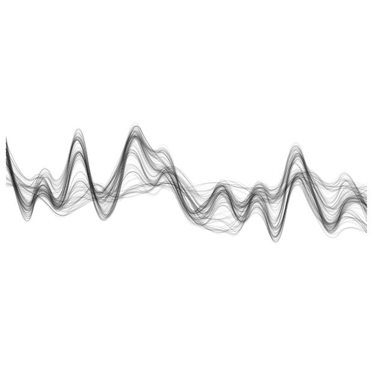

My attempt to reproduce some of the examples from
Tim Holman's [Generative Art Speedrun talk](https://www.youtube.com/watch?v=4Se0_w0ISYk).

## Examples

### [Tiled diagonal lines](01-lines-tiled/)

### [Tiled horizontal and vertical lines](02-lines-tiled/)

### [Displaced lines](03-lines-displaced/)

### [Tiled curves](04-curves-tiled/)

### [Displaced curved lines](05-lines-displaced-curved/)

### [Displaced (center) curved lines ("Joy Division cover")](06-lines-displaced-curved/)

### [Curve repeated](07-curve-repeated/)

